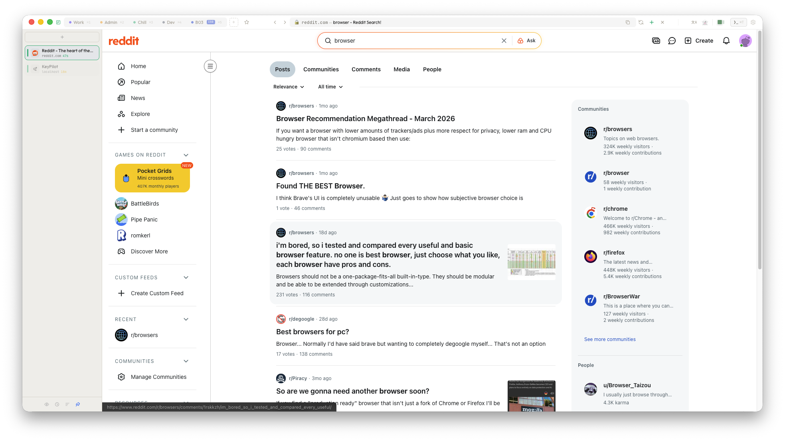
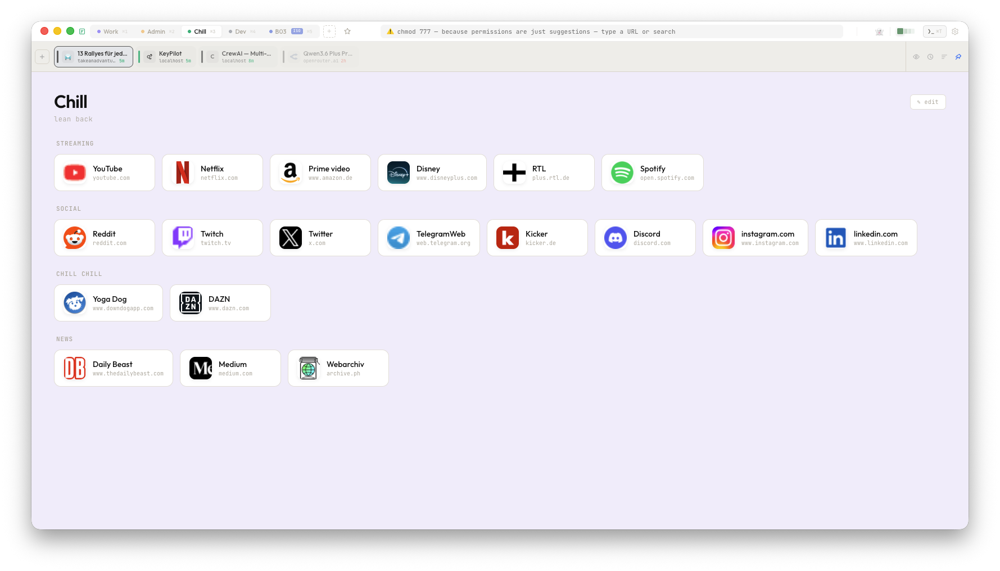
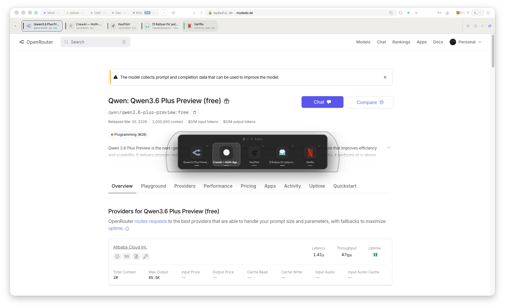
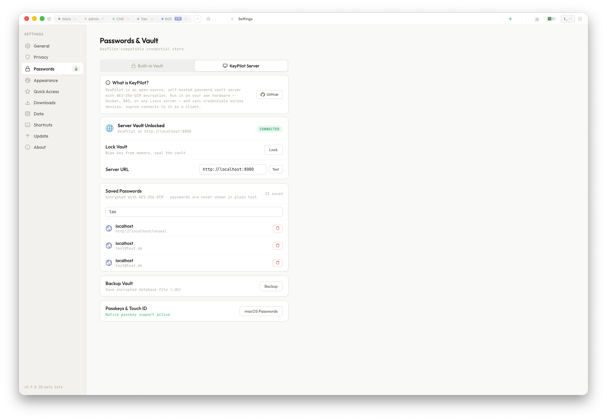
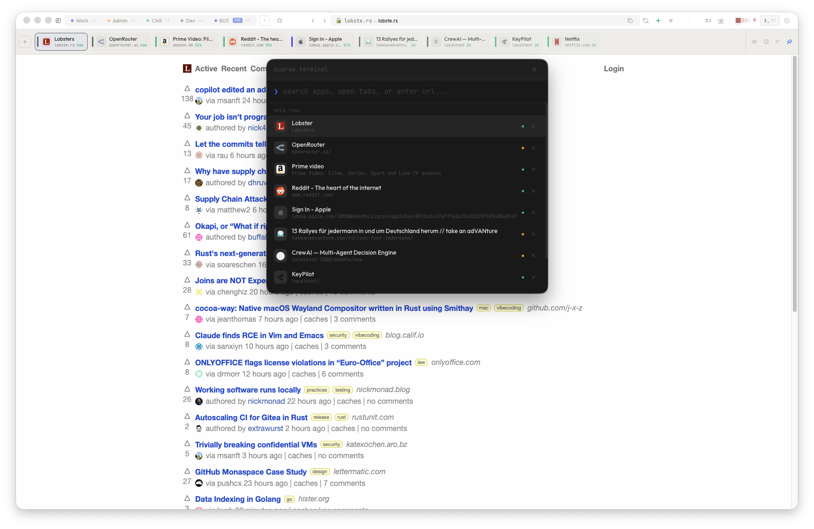

# suprow

A lightweight browser for web apps – built for people who care about focused workflows and tidy desktops.

This repository is **not** the full source code of suprow.  
It is a public hub for:

- **App downloads** (macOS, Windows, Linux)
- **Release notes & changelogs**
- **Screenshots and marketing assets**
- **Issues and pull requests** from the community

Download beta here:
 [suprow.app](https://suprow.app)

---

## What is suprow?

suprow is a **lightweight desktop browser for web apps**.  
It focuses on **fast startup, minimal UI and keyboard‑centric workflows**, so you can keep separate, focused spaces for different kinds of work.

### Key ideas

- **Lightweight browser**  
  Not a bloated, general‑purpose browser, but a focused shell‑style browser for web apps. Fast startup, minimal chrome, maximum focus.

- **Spaces instead of tabs**  
  Organise your tools into spaces like _work_, _deep‑focus_, _playground_.  
  Each space can have its own apps, settings and windows.

- **Keyboard‑centric UI**  
  Terminal‑like vibes with a command palette and clear text UI.  
  suprow feels more like a **window manager for web apps** than a classic browser.

---

## Downloads

> **Note**: Downloads are provided via GitHub Releases in this repository.  
> The desktop app is the primary way to use suprow today – the CLI shown in screenshots is illustrative only.

- **macOS**  
  - `.dmg` for Intel & Apple Silicon  
  - See the latest macOS builds under **Releases → macOS**

- **Windows**  
  - Classic installer and portable `.exe` builds  
  - See the latest Windows builds under **Releases → Windows**

- **Linux** (experimental)  
  - `AppImage` and `.deb` packages (Beta)  
  - See the latest Linux builds under **Releases → Linux**

Download beta here:
 [suprow.app](https://suprow.app)

The `releases/` folder in this repo may contain mirrors or helper files, but the canonical downloads live under GitHub Releases.

---

## Current Beta – v0.9.8.21-beta (Desktop)

- **Stage**: Beta · Desktop only

### New features

- Privacy-first architecture: zero cloud sync, zero telemetry, zero tracking
- Encrypted credentials using your system keychain (macOS Keychain / Windows DPAPI)
- Space lock with idle auto-lock for sensitive workspaces
- Space isolation with separate cookies, cache, logins and storage per space
- Quick Access favorites in the topbar for one-click app/site launch
- Built-in ad and tracker blocking out of the box (uBlock-style filtering)
- Keyboard-centric workflows: command palette (`⌘T`) and tab switcher (`⌘S`)
- Adaptive topbar sizes (Compact / Normal / Large)
- Incognito mode with isolated session and no history persistence
- Local encrypted vault (AES-256-GCM) for credential backup/restore flows

### And there's more

- Translate built in: one-click page translation, with a language picker shortcut
- Timeline Tab Bar: open tabs sorted by recency with time labels and space indicators
- Timeline controls: pin as sidebar/topbar, compact mode, sort by space, auto-close old tabs
- DRM and streaming: Widevine support (CastLabs) for major streaming platforms
- Download manager: progress, pause/resume, and configurable download folder
- Find in page (`⌘F`): minimal search bar with match count and keyboard navigation
- Fullscreen video: native HTML5 fullscreen with automatic UI/topbar hiding

### In progress

- Passkey / Touch ID support for website logins (WebAuthn)
- Split-view for side-by-side browsing
- Start page widget customisation (clock, weather, notes)
- Auto-update support across platforms

---

## Screenshots & assets

The `assets/` directory contains the public marketing images used on the website and in this README.

### App previews







### Settings & terminal teaser





You can also reference these assets from other places (websites, blog posts, etc.) by pointing to the raw file URLs on GitHub or via a CDN that serves GitHub assets.

---

## CLI concept (illustrative)

Some screenshots show a terminal prompt like:

```text
suprow@desktop: ~
λ suprow --space work --app mail
↳ launching focused mail space…
λ suprow --space side --app github --pip
↳ picture‑in‑picture debug browser enabled
```

This is **illustrative only**.  
suprow is a **desktop app today**, not a real CLI tool (yet).  
If a future CLI becomes available, it will be documented here.

---

## How to use this repository

- **Releases & downloads**: grab the latest builds from the **Releases** section.
- **Issues**: report bugs, request features, or ask questions via GitHub Issues.
- **Pull requests**: propose fixes to docs, assets, or metadata via PRs.

If you are looking for the full application source code, it is currently **not** part of this repository.

---

## License

Unless stated otherwise in specific subfolders, assets and documentation in this repository are provided for use with the suprow app and website.  
If you are unsure about a particular use case, please open an Issue to ask.

